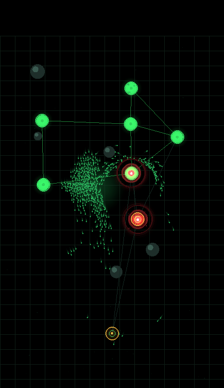
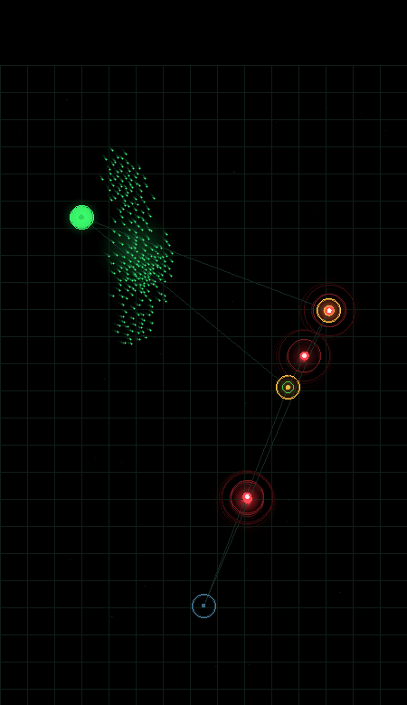

# EVILBOTNET

A botnet swarm-command **roguelite**. **~16 KB of WebAssembly**, no engine, no framework —
hand-written [Zig](https://ziglang.org) rendering straight into a software framebuffer,
running up to ~2,400 flocking agents at 60 fps in your browser via a spatial-hash grid.

You are the botmaster. Lead a swarm of bots across a network, smother nodes to
**infect** them, and seize the whole graph before the red EDR **sentinels** delete
your swarm or scrub your nodes back to clean.

<p align="center">
  
  
</p>

## Play

- **Finger / mouse** — lead the rally point; the swarm flocks toward it.
- **SURGE** (Space) — 1.2 s of speed + immunity. Punch a capture through a defended node.
- **EMP** (Q) — freeze nearby sentinels solid for a couple seconds.
- **FORK** (F) — instantly mass a burst of new bots at the swarm.
- **CLOAK** (C) — the EDR loses sight of your swarm; sneak a capture.
- **WASD / arrows** — nudge the rally point (desktop).

Lead sentinels into the rock obstacles — they snag briefly, which buys you time
(they always free themselves, so it never clogs).

**Roguelite runs:** each level is a network raid. Level 1 starts tiny (3 nodes, one sentinel, open field); clear every node and you **draft one of three upgrades** — bigger swarm, faster spread, overclocked bots, shorter cooldowns, or **unlock a new ability** (EMP / FORK / CLOAK). Then the next level escalates: more nodes, more sentinels, rising **HEAT**, and eventually scattered rock obstacles. Lose your swarm and the run ends — how many levels can you clear? (Best level persists locally.)

Captures are sticky (ownership hysteresis), so you can push outward — but leave a
node undefended too long and a sentinel will grind it back.

**Node types & hazards** (introduced as levels escalate):

- **Spawner** (teal) — once owned, floods out bots fast. Grab it early.
- **Shielded** (blue) — infection barely moves unless you **SURGE** on it to crack the shield.
- **Honeypot** (amber) — capturing it springs a trap and spawns sentinels. Don't grab greedily.
- **Firewall** (red) — a barrier that cycles on/off across the field, blocking bots *and*
  sentinels. Time your push through the gaps — or **EMP** it to drop it on demand.

## How it works

- `src/main.zig` — the whole game: xorshift RNG, a **spatial-hash grid** for
  ~O(n) flocking (separation / alignment / cohesion + seek + threat-avoidance),
  small circular **rock obstacles** with steering avoidance, node infection with hysteresis, a
  **HEAT** escalation system, EDR sentinel AI, particles, **trails + additive
  bloom**, and a software rasterizer writing `u32` RGBA pixels.
- Target is `wasm32-freestanding` — **no libc, no allocator.** Fixed global
  arrays, builtin math only (`@sqrt`, `@floor`, no libm trig), so the module is
  tiny and never traps.
- `web/index.html` instantiates the wasm, copies the framebuffer into a
  `<canvas>` each frame, and feeds input back through exported functions.

## How this was built

The whole thing was built **conversationally from a phone** — no IDE, no local
toolchain — by talking to an AI assistant that had a sandboxed Linux environment
with the Zig compiler and Node.

The loop each iteration:

1. Describe the next change in plain language.
2. The assistant edits `main.zig` / `index.html` and **compiles the wasm headless**
   to catch errors before anything ships.
3. It **verifies behavior without a browser** — running the wasm under Node to
   auto-play balance simulations (does this level still win? how long?), and
   **rendering frames straight to PNG** from the framebuffer to eyeball the visuals.
4. Only once it compiles and the frames/sims look right does it commit and push.
5. **GitHub Actions takes over from there** — see below — and the live site updates
   on its own a minute or two later.

The interesting part is step 3: because the renderer is just a `u32` framebuffer,
the same bytes that become a `<canvas>` in the browser can be dumped to a PNG in a
headless container. That makes a chat-driven, eyes-on verification loop possible
for a *graphical* program with no display attached.

## Build

Requires Zig **0.16.0**.

```sh
zig build           # outputs zig-out/bin/{game.wasm,index.html}
```

Serve `zig-out/bin` with any static server (wasm needs HTTP, not `file://`):

```sh
cd zig-out/bin && python3 -m http.server 8000
# open http://localhost:8000
```

## Deploy (push-to-Pages via GitHub Actions)

Every push to `main` triggers `.github/workflows/deploy.yml`:

1. `mlugg/setup-zig` pins Zig **0.16.0**.
2. `zig build` compiles the wasm and stages `zig-out/bin`.
3. `actions/upload-pages-artifact` + `actions/deploy-pages` publish it to GitHub Pages.

So a single `git push` is the entire release pipeline — no manual build, no upload
step. Enable Pages → Source: **GitHub Actions** in repo settings once, and every
commit thereafter self-deploys.

## License

MIT — do what you want.
